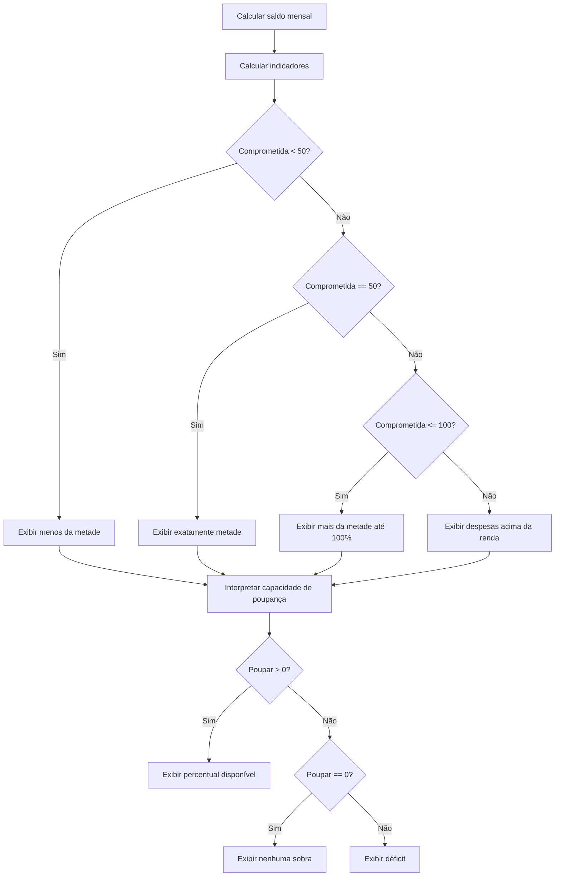

# Fluxograma

Fluxo simplificado da interpretação dos indicadores adicionada na v1.1.3.

```mermaid
flowchart TD
    A[Calcular saldo mensal] --> B[Calcular indicadores]
    B --> C{Comprometida < 50?}
    C -- Sim --> D[Exibir menos da metade]
    C -- Não --> E{Comprometida == 50?}
    E -- Sim --> F[Exibir exatamente metade]
    E -- Não --> G{Comprometida <= 100?}
    G -- Sim --> H[Exibir mais da metade até 100%]
    G -- Não --> I[Exibir despesas acima da renda]
    D --> J[Interpretar capacidade de poupança]
    F --> J
    H --> J
    I --> J
    J --> K{Poupar > 0?}
    K -- Sim --> L[Exibir percentual disponível]
    K -- Não --> M{Poupar == 0?}
    M -- Sim --> N[Exibir nenhuma sobra]
    M -- Não --> O[Exibir déficit]
```
