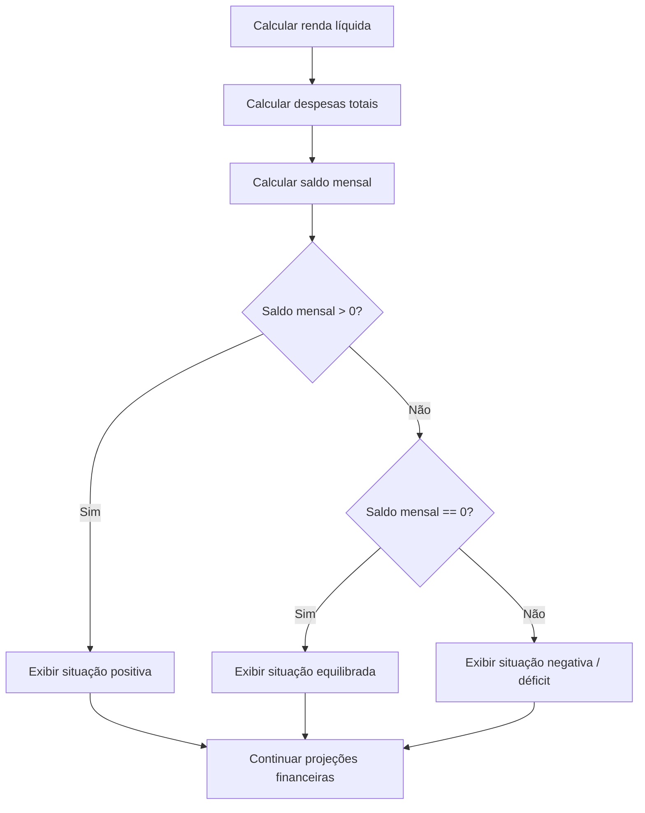

# Fluxograma

Diagrama da interpretação do saldo mensal adicionada na v1.1.2.

```mermaid
flowchart TD
    A[Calcular renda líquida] --> B[Calcular despesas totais]
    B --> C[Calcular saldo mensal]
    C --> D{Saldo mensal > 0?}
    D -- Sim --> E[Exibir situação positiva]
    D -- Não --> F{Saldo mensal == 0?}
    F -- Sim --> G[Exibir situação equilibrada]
    F -- Não --> H[Exibir situação negativa / déficit]
    E --> I[Continuar projeções financeiras]
    G --> I
    H --> I
```

Saldo negativo é uma situação financeira a informar, não uma falha do programa.
